```r
# Packages:
library(stringr)
library(lubridate)
library(gridExtra)
library(tidyverse)
```

```
## Warning: package 'tidyverse' was built under R version 3.4.1
```

```
## Loading tidyverse: ggplot2
## Loading tidyverse: tibble
## Loading tidyverse: tidyr
## Loading tidyverse: readr
## Loading tidyverse: purrr
## Loading tidyverse: dplyr
```

```
## Warning: package 'ggplot2' was built under R version 3.4.1
```

```
## Warning: package 'tibble' was built under R version 3.4.1
```

```
## Warning: package 'tidyr' was built under R version 3.4.1
```

```
## Warning: package 'purrr' was built under R version 3.4.1
```

```
## Warning: package 'dplyr' was built under R version 3.4.1
```

```
## Conflicts with tidy packages ----------------------------------------------
```

```
## as.difftime(): lubridate, base
## combine():     dplyr, gridExtra
## date():        lubridate, base
## filter():      dplyr, stats
## intersect():   lubridate, base
## lag():         dplyr, stats
## setdiff():     lubridate, base
## union():       lubridate, base
```

```r
library(scales)
```

```
## Warning: package 'scales' was built under R version 3.4.1
```

```
## 
## Attaching package: 'scales'
```

```
## The following object is masked from 'package:purrr':
## 
##     discard
```

```
## The following object is masked from 'package:readr':
## 
##     col_factor
```

```r
library(ggplot2)

# load and tidy  ----------------------------------------------------------

df <- read.csv('thrice.df.csv', header = TRUE, stringsAsFactors = FALSE)
str(df, list.len = 3)
```

```
## 'data.frame':	103 obs. of  9 variables:
##  $ ID      : int  1 2 3 4 5 6 7 8 9 10 ...
##  $ album   : chr  "Identity Crisis" "Identity Crisis" "Identity Crisis" "Identity Crisis" ...
##  $ year    : int  2000 2000 2000 2000 2000 2000 2000 2000 2000 2000 ...
##   [list output truncated]
```

```r
df2 <- read.csv('thrice.df.csv', header = FALSE, stringsAsFactors = FALSE)
str(df2, list.len = 3)
```

```
## 'data.frame':	104 obs. of  9 variables:
##  $ V1: chr  "ID" "1" "2" "3" ...
##  $ V2: chr  "album" "Identity Crisis" "Identity Crisis" "Identity Crisis" ...
##  $ V3: chr  "year" "2000" "2000" "2000" ...
##   [list output truncated]
```

```r
# very important to set header = TRUE if have variable names already
# or else your column names will appear on their own in the first row!

# Examining dataframes:
str(df)
```

```
## 'data.frame':	103 obs. of  9 variables:
##  $ ID      : int  1 2 3 4 5 6 7 8 9 10 ...
##  $ album   : chr  "Identity Crisis" "Identity Crisis" "Identity Crisis" "Identity Crisis" ...
##  $ year    : int  2000 2000 2000 2000 2000 2000 2000 2000 2000 2000 ...
##  $ tracknum: int  1 2 3 4 5 6 7 8 9 10 ...
##  $ title   : chr  "Identity Crisis" "Phoenix Ignition" "In Your Hands" "To What End" ...
##  $ writers : chr  "Dustin Kensrue" "Dustin Kensrue" "Riley Breckenridge" "Dustin Kensrue" ...
##  $ length  : chr  "2M 58S" "3M 31S" "2M 47S" "3M 4S" ...
##  $ lengthS : chr  "178S" "211S" "167S" "184S" ...
##  $ lyrics  : chr  "Image marred by self-infliction <br>  Private wars on my soul waged <br>  Heart is scarred by dual volitions <b"| __truncated__ "Like a phoenix ignition <br>  like a crematorium <br>  Like a swelling volition <br>  from the barrel of a gun "| __truncated__ "\nbound to this couch, i lie in waiting <br> watching wind blown memories slip by my window sill <br> i can't f"| __truncated__ "To what end! <br> To what end do we <br> proceed so boldly <br> if all we are is <br> chemical reactions <br> a"| __truncated__ ...
```

```r
str(df, list.len = 4)
```

```
## 'data.frame':	103 obs. of  9 variables:
##  $ ID      : int  1 2 3 4 5 6 7 8 9 10 ...
##  $ album   : chr  "Identity Crisis" "Identity Crisis" "Identity Crisis" "Identity Crisis" ...
##  $ year    : int  2000 2000 2000 2000 2000 2000 2000 2000 2000 2000 ...
##  $ tracknum: int  1 2 3 4 5 6 7 8 9 10 ...
##   [list output truncated]
```

```r
str(df, vec.len = 3, nchar.max = 20)
```

```
## 'data.frame':	103 obs. of  9 variables:
##  $ ID      : int  1 2 3 4 5 6 7 8 ...
##  $ album   : chr  "Identity Crisis" "Identity Crisis" "Identity Crisis" ...
##  $ year    : int  2000 | __truncated__ ...
##  $ tracknum: int  1 2 3 4 5 6 7 8 ...
##  $ title   : chr  "Identity Crisis" "Phoenix Ignition" "In Your Hands" ...
##  $ writers : chr  "Dustin Kensrue" "Dustin Kensrue" "Riley Breckenridge" ...
##  $ length  : chr  "2M 58S" "3M 31S" "2M 47S" ...
##  $ lengthS : chr  "178S" "211S" "167S" ...
##  $ lyrics  : chr  "Ima"| __truncated__ "Lik"| __truncated__ "\nb"| __truncated__ ...
```

```r
glimpse(df)
```

```
## Observations: 103
## Variables: 9
## $ ID       <int> 1, 2, 3, 4, 5, 6, 7, 8, 9, 10, 11, 12, 13, 14, 15, 16...
## $ album    <chr> "Identity Crisis", "Identity Crisis", "Identity Crisi...
## $ year     <int> 2000, 2000, 2000, 2000, 2000, 2000, 2000, 2000, 2000,...
## $ tracknum <int> 1, 2, 3, 4, 5, 6, 7, 8, 9, 10, 11, 1, 2, 3, 4, 5, 6, ...
## $ title    <chr> "Identity Crisis", "Phoenix Ignition", "In Your Hands...
## $ writers  <chr> "Dustin Kensrue", "Dustin Kensrue", "Riley Breckenrid...
## $ length   <chr> "2M 58S", "3M 31S", "2M 47S", "3M 4S", "3M 2S", "2M 4...
## $ lengthS  <chr> "178S", "211S", "167S", "184S", "182S", "124S", "57S"...
## $ lyrics   <chr> "Image marred by self-infliction <br>  Private wars o...
```

```r
# song ID, year, track num = integer
# all else chr


# use lubridate pkg to tranform length and lengthS
# turn album var into a factor variable for each unique album!
?ms()  # transforms chr/num vector into period object
?seconds()  # create period object in seconds

df <- df %>% 
  mutate(album = factor(album, levels = unique(album)),
         year = factor(year, levels = unique(year)),
         length = ms(length),
         lengthS = seconds(length))
```

```
## Warning: package 'bindrcpp' was built under R version 3.4.1
```

```r
df2 <- df %>% mutate(
  length = as.duration(length),
  lengthS = duration(second = length))


?ms()
str(df$length)
```

```
## Formal class 'Period' [package "lubridate"] with 6 slots
##   ..@ .Data : num [1:103] 58 31 47 4 2 4 57 10 23 46 ...
##   ..@ year  : num [1:103] 0 0 0 0 0 0 0 0 0 0 ...
##   ..@ month : num [1:103] 0 0 0 0 0 0 0 0 0 0 ...
##   ..@ day   : num [1:103] 0 0 0 0 0 0 0 0 0 0 ...
##   ..@ hour  : num [1:103] 0 0 0 0 0 0 0 0 0 0 ...
##   ..@ minute: num [1:103] 2 3 2 3 3 2 0 4 4 4 ...
```

```r
str(df$lengthS)
```

```
## Formal class 'Period' [package "lubridate"] with 6 slots
##   ..@ .Data : num [1:103] 178 211 167 184 182 124 57 250 263 286 ...
##   ..@ year  : num [1:103] 0 0 0 0 0 0 0 0 0 0 ...
##   ..@ month : num [1:103] 0 0 0 0 0 0 0 0 0 0 ...
##   ..@ day   : num [1:103] 0 0 0 0 0 0 0 0 0 0 ...
##   ..@ hour  : num [1:103] 0 0 0 0 0 0 0 0 0 0 ...
##   ..@ minute: num [1:103] 0 0 0 0 0 0 0 0 0 0 ...
```

```r
str(df, list.len = 8, max.level = 2)
```

```
## 'data.frame':	103 obs. of  9 variables:
##  $ ID      : int  1 2 3 4 5 6 7 8 9 10 ...
##  $ album   : Factor w/ 11 levels "Identity Crisis",..: 1 1 1 1 1 1 1 1 1 1 ...
##  $ year    : Factor w/ 8 levels "2000","2002",..: 1 1 1 1 1 1 1 1 1 1 ...
##  $ tracknum: int  1 2 3 4 5 6 7 8 9 10 ...
##  $ title   : chr  "Identity Crisis" "Phoenix Ignition" "In Your Hands" "To What End" ...
##  $ writers : chr  "Dustin Kensrue" "Dustin Kensrue" "Riley Breckenridge" "Dustin Kensrue" ...
##  $ length  :Formal class 'Period' [package "lubridate"] with 6 slots
##  $ lengthS :Formal class 'Period' [package "lubridate"] with 6 slots
##   [list output truncated]
```

```r
glimpse(df)
```

```
## Observations: 103
## Variables: 9
## $ ID       <int> 1, 2, 3, 4, 5, 6, 7, 8, 9, 10, 11, 12, 13, 14, 15, 16...
## $ album    <fctr> Identity Crisis, Identity Crisis, Identity Crisis, I...
## $ year     <fctr> 2000, 2000, 2000, 2000, 2000, 2000, 2000, 2000, 2000...
## $ tracknum <int> 1, 2, 3, 4, 5, 6, 7, 8, 9, 10, 11, 1, 2, 3, 4, 5, 6, ...
## $ title    <chr> "Identity Crisis", "Phoenix Ignition", "In Your Hands...
## $ writers  <chr> "Dustin Kensrue", "Dustin Kensrue", "Riley Breckenrid...
## $ length   <S4: Period> 2M 58S, 3M 31S, 2M 47S, 3M 4S, 3M 2S, 2M 4S, 5...
## $ lengthS  <S4: Period> 178S, 211S, 167S, 184S, 182S, 124S, 57S, 250S,...
## $ lyrics   <chr> "Image marred by self-infliction <br>  Private wars o...
```

```r
# both length and lengthS are now Period/S4 variables!
# album is a factor!

# Explore our data -----------------------------------------------


length(unique(df$album))  # How many total albums have Thrice released?? (Counting each element from AlchemyIndex...)
```

```
## [1] 11
```

```r
df %>% select(album) %>% n_distinct()  # number of Thrice albums (so far..!)
```

```
## [1] 11
```

```r
df %>% select(album, year) %>% unique()  # list of all Thrice albums (so far...!)
```

```
##                                 album year
## 1                     Identity Crisis 2000
## 12             The Illusion Of Safety 2002
## 25        The Artist In The Ambulance 2003
## 37                            Vheissu 2005
## 48             The Alchemy Index Fire 2007
## 54            The Alchemy Index Water 2007
## 60              The Alchemy Index Air 2007
## 66            The Alchemy Index Earth 2007
## 72                            Beggars 2009
## 82                        Major Minor 2011
## 93 To Be Everywhere And To Be Nowhere 2016
```

```r
albums_lengths <- df %>% 
  group_by(album, year) %>% 
  summarise(SongNum = n(),
            duration = as.duration(seconds_to_period(sum(lengthS))))  

str(albums_lengths)
```

```
## Classes 'grouped_df', 'tbl_df', 'tbl' and 'data.frame':	11 obs. of  4 variables:
##  $ album   : Factor w/ 11 levels "Identity Crisis",..: 1 2 3 4 5 6 7 8 9 10 ...
##  $ year    : Factor w/ 8 levels "2000","2002",..: 1 2 3 4 5 5 5 5 6 7 ...
##  $ SongNum : int  11 13 12 11 6 6 6 6 10 11 ...
##  $ duration:Formal class 'Duration' [package "lubridate"] with 1 slot
##   .. ..@ .Data: num  2142 2307 2374 2960 1327 ...
##  - attr(*, "vars")= chr "album"
##  - attr(*, "drop")= logi TRUE
```

```r
albums_lengths %>% 
  arrange(desc(duration))
```

```
## # A tibble: 11 x 4
## # Groups:   album [11]
##                                 album   year SongNum
##                                <fctr> <fctr>   <int>
##  1                        Major Minor   2011      11
##  2                            Vheissu   2005      11
##  3                            Beggars   2009      10
##  4 To Be Everywhere And To Be Nowhere   2016      11
##  5        The Artist In The Ambulance   2003      12
##  6             The Illusion Of Safety   2002      13
##  7                    Identity Crisis   2000      11
##  8            The Alchemy Index Water   2007       6
##  9              The Alchemy Index Air   2007       6
## 10             The Alchemy Index Fire   2007       6
## 11            The Alchemy Index Earth   2007       6
## # ... with 1 more variables: duration <S4: Duration>
```

```r
df %>% 
  group_by(year, album) %>% 
  summarise(SongNum = n(),
            durationInMinutes = sum(lengthS)/60) %>%    # lengthS in seconds / 60 to get in minutes!
  arrange(desc(durationInMinutes))
```

```
## # A tibble: 11 x 4
## # Groups:   year [8]
##      year                              album SongNum durationInMinutes
##    <fctr>                             <fctr>   <int>             <dbl>
##  1   2011                        Major Minor      11          49.36667
##  2   2005                            Vheissu      11          49.33333
##  3   2009                            Beggars      10          43.73333
##  4   2016 To Be Everywhere And To Be Nowhere      11          41.60000
##  5   2003        The Artist In The Ambulance      12          39.56667
##  6   2002             The Illusion Of Safety      13          38.45000
##  7   2000                    Identity Crisis      11          35.70000
##  8   2007            The Alchemy Index Water       6          27.11667
##  9   2007              The Alchemy Index Air       6          24.23333
## 10   2007             The Alchemy Index Fire       6          22.11667
## 11   2007            The Alchemy Index Earth       6          20.93333
```

```r
# song lengths
song_lengths <- df %>% 
  group_by(title, album) %>% 
  summarise(duration = as.duration(sum(lengthS)))

song_lengths %>% arrange(desc(duration))
```

```
## # A tibble: 103 x 3
## # Groups:   title [103]
##                          title                              album
##                          <chr>                             <fctr>
##  1          Words In The Water                        Major Minor
##  2             Salt And Shadow To Be Everywhere And To Be Nowhere
##  3                Night Diving            The Alchemy Index Water
##  4                    Daedalus              The Alchemy Index Air
##  5   Stand And Feel Your Worth                            Vheissu
##  6                     Beggars                            Beggars
##  7 A Song For Milly Michaelson              The Alchemy Index Air
##  8                  The Weight                            Beggars
##  9     The Earth Isn't Humming            The Alchemy Index Earth
## 10         Kings Upon The Main            The Alchemy Index Water
## # ... with 93 more rows, and 1 more variables: duration <S4: Duration>
```

```r
# works if NOT use seconds_to_period(), but minutes still in base-10... not very elegant but w/e
# Major/Minor and Vheissu are longest albums both totalling up to a bit over 49 mins!
# Although if we took The Alchemy Index in its entirety, then W/F/A/E totalled up would be 
df %>% 
  filter(grepl("Index", album)) %>% 
  summarise(duration_minutes = sum(lengthS)/60)
```

```
##   duration_minutes
## 1             94.4
```

```r
# or use stringr pkg's str_detect()
df %>% 
  filter(str_detect(album, "Index")) %>% 
  summarise(duration_minutes = seconds_to_period(sum(lengthS)))
```

```
##   duration_minutes
## 1       1H 34M 24S
```

```r
df %>% 
  filter(album == "Vheissu") %>% 
  summarise(duration_minutes = as.duration(sum(lengthS)))
```

```
##         duration_minutes
## 1 2960s (~49.33 minutes)
```

```r
df %>% 
  group_by(album) %>% 
  summarise(duration_minutes = as.duration(sum(lengthS)))
```

```
## # A tibble: 11 x 2
##                                 album       duration_minutes
##                                <fctr>         <S4: Duration>
##  1                    Identity Crisis  2142s (~35.7 minutes)
##  2             The Illusion Of Safety 2307s (~38.45 minutes)
##  3        The Artist In The Ambulance 2374s (~39.57 minutes)
##  4                            Vheissu 2960s (~49.33 minutes)
##  5             The Alchemy Index Fire 1327s (~22.12 minutes)
##  6            The Alchemy Index Water 1627s (~27.12 minutes)
##  7              The Alchemy Index Air 1454s (~24.23 minutes)
##  8            The Alchemy Index Earth 1256s (~20.93 minutes)
##  9                            Beggars 2624s (~43.73 minutes)
## 10                        Major Minor 2962s (~49.37 minutes)
## 11 To Be Everywhere And To Be Nowhere  2496s (~41.6 minutes)
```

```r
df %>% 
  group_by(title) %>% 
  summarise(duration_song = as.duration(sum(lengthS)))
```

```
## # A tibble: 103 x 2
##                             title        duration_song
##                             <chr>       <S4: Duration>
##  1 A Living Dance Upon Dead Minds 212s (~3.53 minutes)
##  2    A Song For Milly Michaelson 307s (~5.12 minutes)
##  3                A Subtle Dagger  108s (~1.8 minutes)
##  4     A Torch To End All Torches 250s (~4.17 minutes)
##  5                All That's Left 200s (~3.33 minutes)
##  6           All The World Is Mad 239s (~3.98 minutes)
##  7                      Anthology  264s (~4.4 minutes)
##  8              As The Crow Flies 142s (~2.37 minutes)
##  9              As The Ruin Falls 124s (~2.07 minutes)
## 10                    At The Last 245s (~4.08 minutes)
## # ... with 93 more rows
```

```r
# Plotting! ---------------------------------------------------------------

df %>% ggplot(aes(x = as.numeric(lengthS))) + 
  geom_histogram(binwidth = 10, 
                 color = 'white',
                 fill = 'darkgreen') +
  scale_y_continuous(breaks = pretty_breaks(), 
                      limits = c(0, 13), expand = c(0, 0)) +   # expand 0,0 to reduce space
  scale_x_continuous(breaks = pretty_breaks(10), 
                     limits = c(0, 420), expand = c(0, 0)) +  # set limits manually
  xlab('Seconds') +
  ylab('# of Songs') +
  labs(title = 'Distr. of Songs by Length') +
  theme_bw() +
  theme(axis.text = element_text(size = 14, face = "bold", color = "#252525"))
```

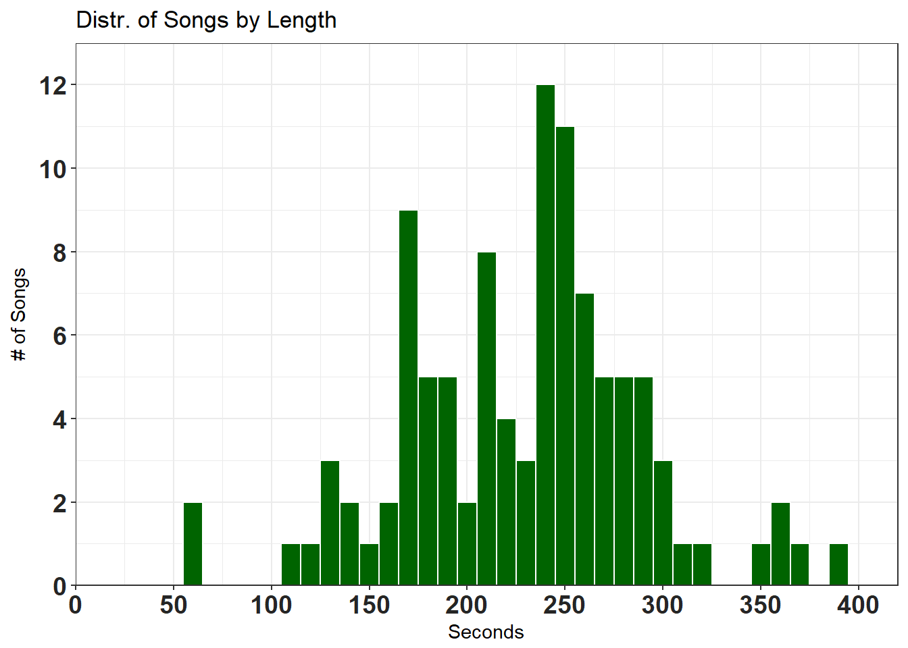

```r
# by minutes along x-axis
df %>% ggplot(aes(x = as.numeric(lengthS)/60)) + 
  geom_histogram(binwidth = 0.5, 
                 color = 'white',
                 fill = 'darkgreen') +
  scale_y_continuous(breaks = pretty_breaks(10), 
                     expand = c(0,0), limits = c(0, 30)) +
  scale_x_continuous(breaks = pretty_breaks(5)) +
  xlab('Minutes') +
  ylab('# of Songs') +
  labs(title = 'Distr. of Songs by Length') +
  theme_bw() +
  theme(axis.text = element_text(size = 14, color = "#252525"),
        axis.title = element_text(size = 14))
```

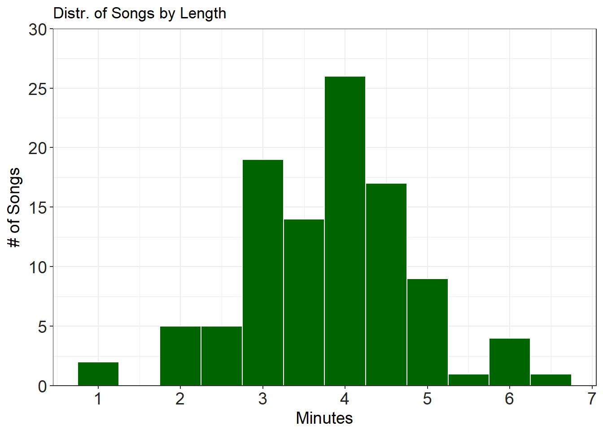

```r
# facet by album? facet_wrap() vs facet_grid()
histogram <- df %>% 
  ggplot(aes(x = as.numeric(lengthS)/60)) + 
  geom_histogram(binwidth = 0.5, 
                 color = "#FFFFFF",
                 fill = "#006400") +
  scale_y_continuous(breaks = pretty_breaks(), expand = c(0, 0), limits = c(0, 7)) +
  scale_x_continuous(breaks = pretty_breaks()) +
  xlab('Minutes') +
  ylab('# of Songs') +
  labs(title = 'Distr. of Songs by Length') +
  theme_bw() +
  theme(axis.text = element_text(size = 8, color = "#252525"),
        axis.title = element_text(size = 8)) 

histogram
```

```
## Warning: Removed 5 rows containing missing values (geom_bar).
```

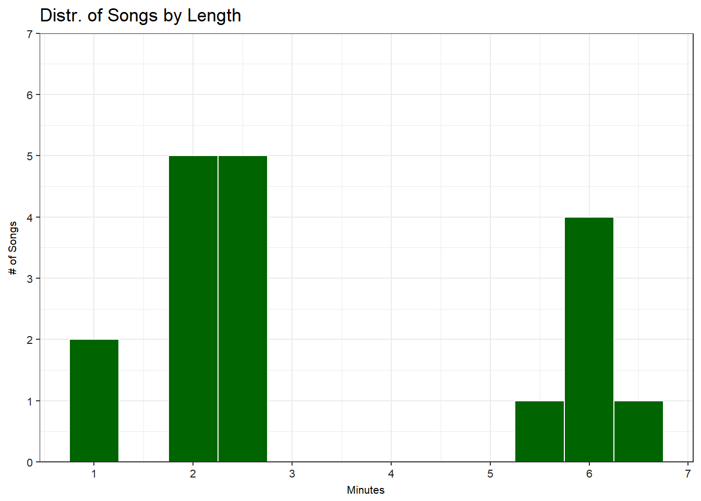

```r
histogram + facet_wrap(~album)
```

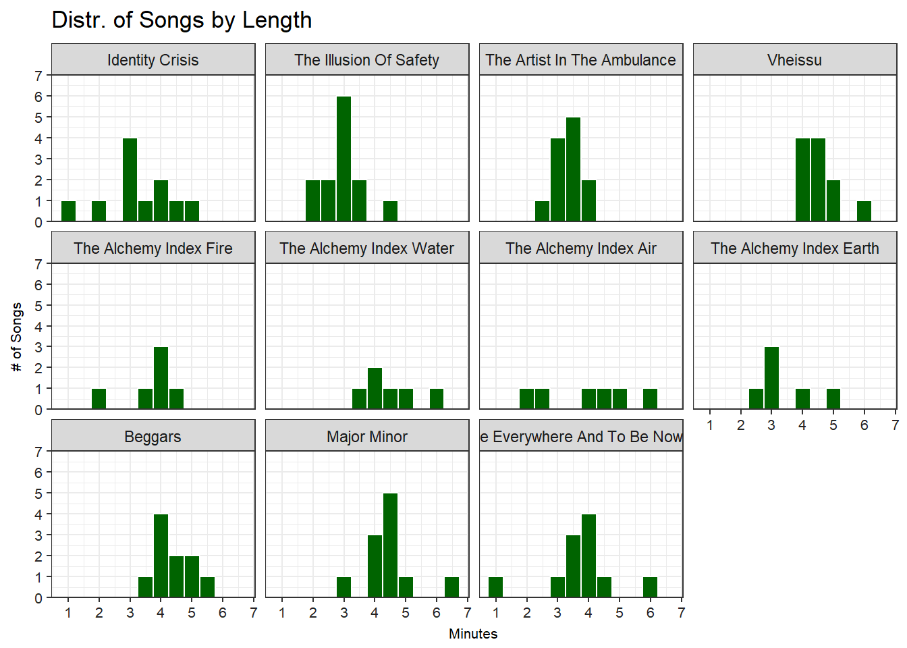

```r
# hard to interpret

# grid
histogram + facet_grid(~album)
```

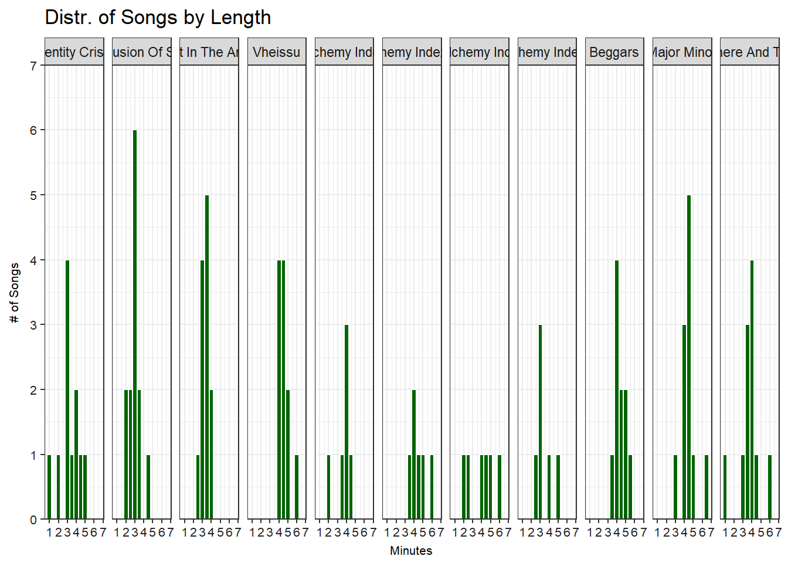

```r
# better but hard to understand the differences between albums

# the other way around?
histogram + facet_grid(album ~.)
```

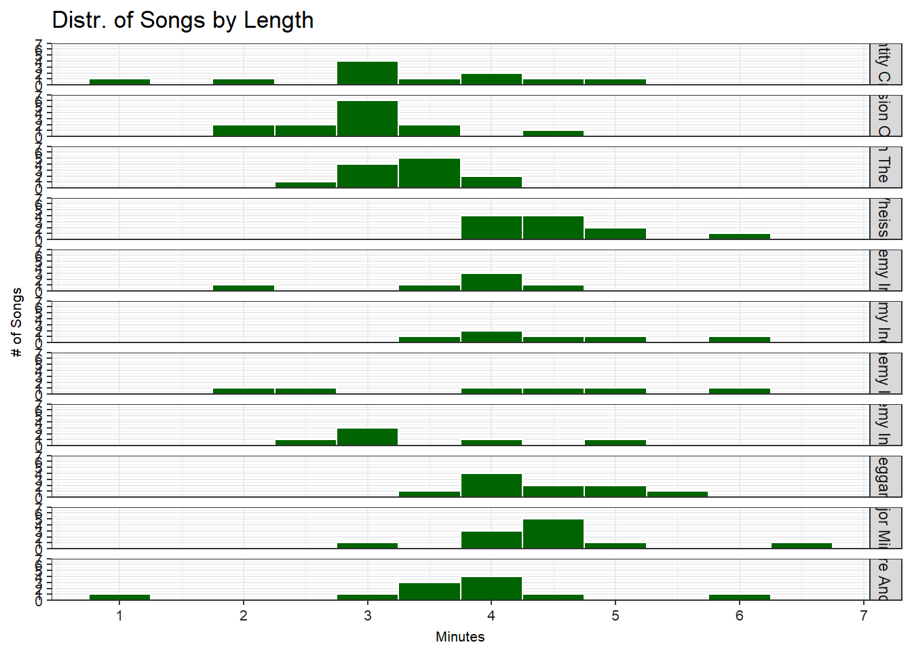

```r
# can compare each of the histograms, but the bars make it hard to discern differences...
# try adding in trend lines for each?

histogram + facet_grid(album ~.) + 
  geom_smooth(se = FALSE, stat = "bin", bins = 10, col = "red")
```

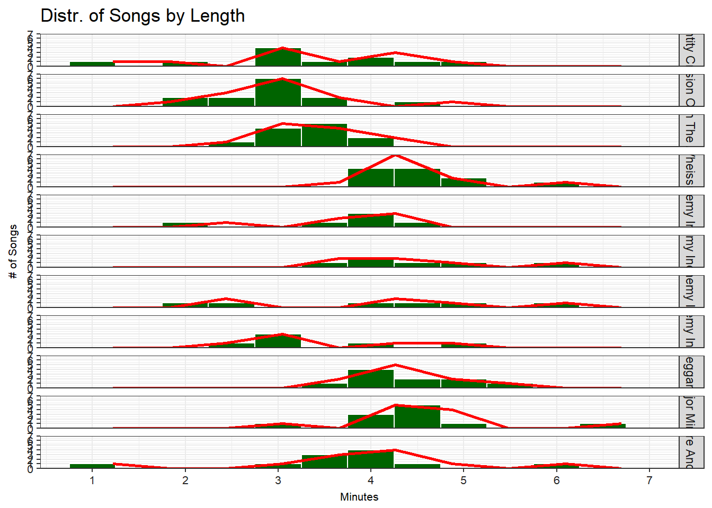

```r
# let's try alternating the colors for each album 
# also, reorder the albums in order of song lengths
# histogram of joy plot

hist <- df %>% 
  mutate(group = reorder(album, lengthS)) %>%
  arrange(group) %>% 
  ggplot(aes(x = as.numeric(lengthS)/60, fill = group)) + 
  geom_histogram(binwidth = 0.5, 
                 color = "#FFFFFF") +
  scale_y_continuous(breaks = pretty_breaks()) +
  scale_x_continuous(breaks = pretty_breaks(5)) +
  xlab('Minutes') +
  ylab('# of Songs') +
  labs(title = 'Distr. of Songs by Length') +
  facet_grid(group ~.) +
  scale_fill_manual(values = rep(c("#006400", "#404040"), length(unique(df$album)))) +
  theme_bw() +
  theme(legend.position = "none")

hist
```

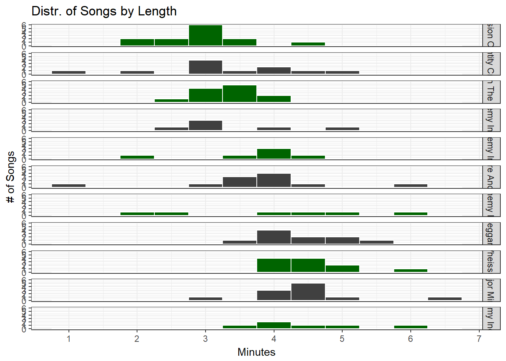

```r
# can somewhat see that Illusion of Safety has the least songs in 


# Joy Plots ---------------------------------------------------------------

# JoyPlot
library(ggjoy)
```

```
## Warning: package 'ggjoy' was built under R version 3.4.1
```

```r
?arrange()

df %>% 
  ggplot(aes(x = as.numeric(lengthS)/60, y = album)) +
  geom_joy() +
  xlab('Minutes') +
  scale_x_continuous(breaks = pretty_breaks(7))
```

```
## Picking joint bandwidth of 0.377
```

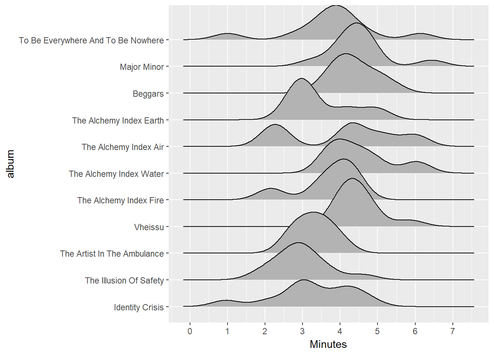

```r
# attempt 1
df %>% 
  mutate(group = reorder(album, desc(lengthS))) %>%     # reorder based on lengthS
  ggplot(aes(x = as.numeric(lengthS), y = group, fill = album)) +  # fill on group as they are ordered instead of just album! worked! :D
  geom_joy(scale = 2) +     # scale to set overlap between ridges
  xlab('Seconds') +
  scale_x_continuous(breaks = pretty_breaks(5)) +
  scale_fill_manual(values = rep(c("#006400", "#404040"), length(unique(df$album)))) +
  theme_bw() +
  theme(legend.position = "none")
```

```
## Picking joint bandwidth of 22.6
```

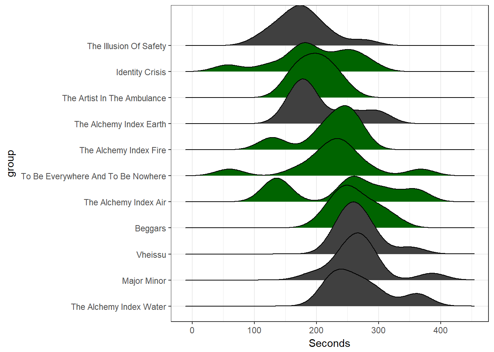

```r
# attempt 2 and success!
joyplot <- df %>% 
  mutate(group = reorder(album, desc(lengthS))) %>%     # reorder based on lengthS
  ggplot(aes(x = as.numeric(lengthS)/60, y = group, fill = group)) +  # fill on group as they are ordered instead of just album! worked! :D
  geom_joy() +
  xlab('Minutes') +
  scale_x_continuous(breaks = pretty_breaks(10)) +
  scale_y_discrete(expand = c(0, 0)) +
  scale_fill_manual(values = rep(c("#006400", "#404040"), length(unique(df$album)))) +
  theme_bw() +
  theme(legend.position = "none")

joyplot
```

```
## Picking joint bandwidth of 0.377
```

```r
# near the longer albums, what really sets them apart is the small number of songs that are 
# 6 minutes or longer... otherwise mainly max out at around 4 minute long songs
# AI-Water should not really count as it's position is due to a 6 min long instrumental!
# the two shortest, seen in "TBEATBN" and "Identity Crisis" are also ~minute long instrumentals!


# add vertical mean song length line? geom_vline

# vertical line for each lengthS by album?

library(grid)
pushViewport(viewport(layout = grid.layout(1,2)))
print(joyplot, vp = viewport(layout.pos.row = 1, layout.pos.col = 1))
```

```
## Picking joint bandwidth of 0.377
```

```r
print(hist, vp = viewport(layout.pos.row = 1, layout.pos.col = 2))
```

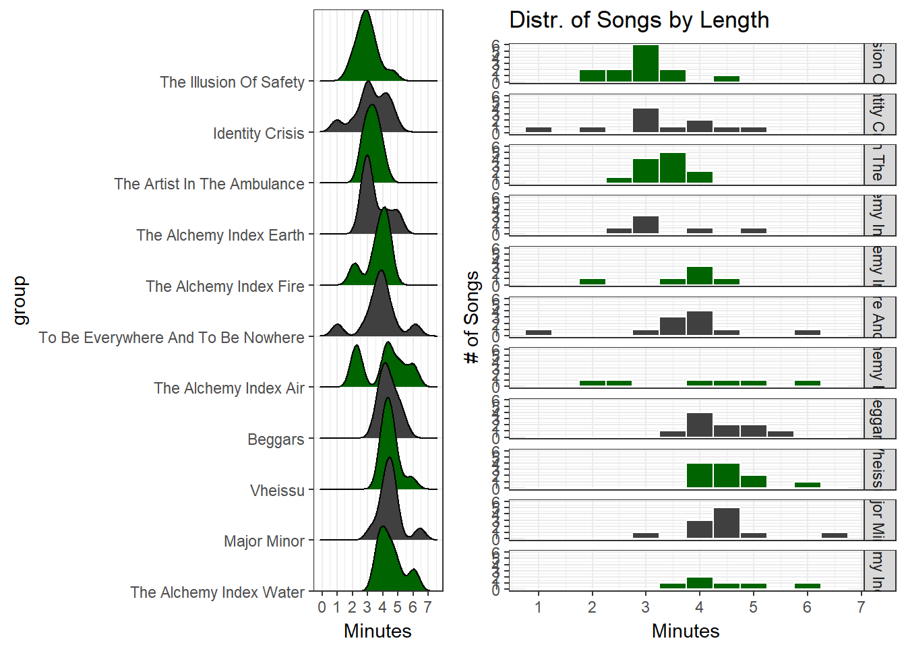

```r
gridExtra::grid.arrange(joyplot, hist, nrow = 1)
```

```
## Picking joint bandwidth of 0.377
```


```r
# doesn't look very good in this instance...
?grid.arrange


albums_lengths %>% mutate(group = reorder(album, desc(duration))) %>% 
  ggplot(aes(x = as.numeric(duration), y = group, fill = group)) +  # fill on group as they are ordered instead of just album! worked! :D
  geom_joy() +
  xlab('seconds') +
  scale_x_continuous(breaks = pretty_breaks(10)) +
  scale_y_discrete(expand = c(0, 0)) +
  scale_fill_manual(values = rep(c("#006400", "#404040"), length(unique(song_lengths$album)))) +
  theme_bw() +
  theme(legend.position = "none")
```

```
## Picking joint bandwidth of NaN
```

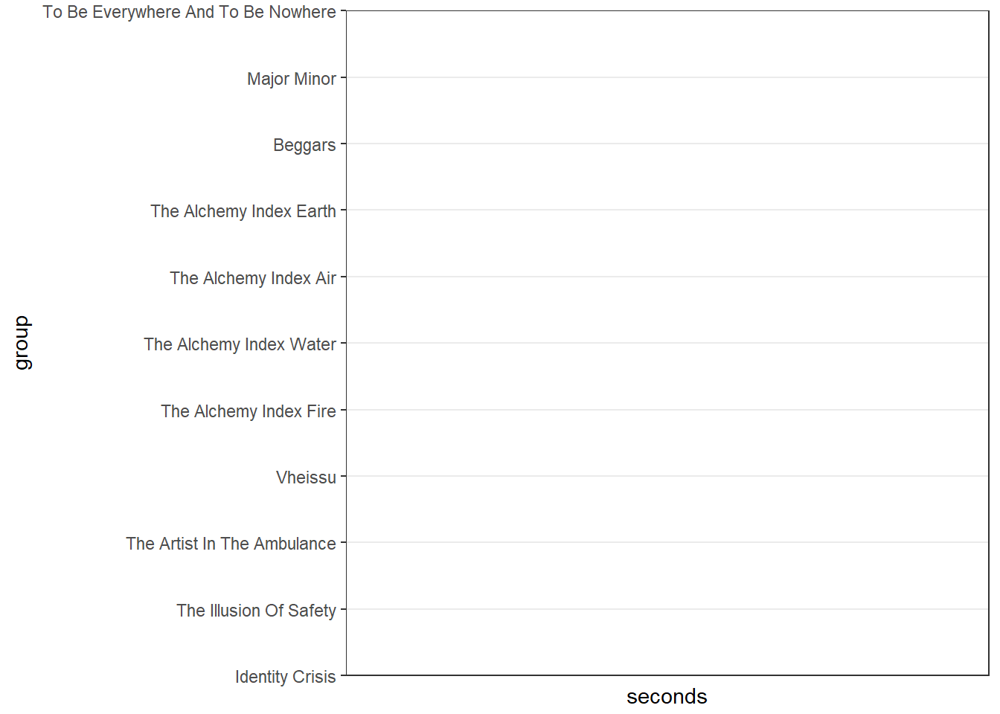

```r
albums_lengths %>% str()
```

```
## Classes 'grouped_df', 'tbl_df', 'tbl' and 'data.frame':	11 obs. of  4 variables:
##  $ album   : Factor w/ 11 levels "Identity Crisis",..: 1 2 3 4 5 6 7 8 9 10 ...
##  $ year    : Factor w/ 8 levels "2000","2002",..: 1 2 3 4 5 5 5 5 6 7 ...
##  $ SongNum : int  11 13 12 11 6 6 6 6 10 11 ...
##  $ duration:Formal class 'Duration' [package "lubridate"] with 1 slot
##   .. ..@ .Data: num  2142 2307 2374 2960 1327 ...
##  - attr(*, "vars")= chr "album"
##  - attr(*, "drop")= logi TRUE
##  - attr(*, "indices")=List of 11
##   ..$ : int 0
##   ..$ : int 1
##   ..$ : int 2
##   ..$ : int 3
##   ..$ : int 4
##   ..$ : int 5
##   ..$ : int 6
##   ..$ : int 7
##   ..$ : int 8
##   ..$ : int 9
##   ..$ : int 10
##  - attr(*, "group_sizes")= int  1 1 1 1 1 1 1 1 1 1 ...
##  - attr(*, "biggest_group_size")= int 1
##  - attr(*, "labels")='data.frame':	11 obs. of  1 variable:
##   ..$ album: Factor w/ 11 levels "Identity Crisis",..: 1 2 3 4 5 6 7 8 9 10 ...
##   ..- attr(*, "vars")= chr "album"
##   ..- attr(*, "drop")= logi TRUE
```

```r
albums_lengths %>% select(duration) %>% class()
```

```
## Adding missing grouping variables: `album`
```

```
## [1] "grouped_df" "tbl_df"     "tbl"        "data.frame"
```

```r
str(df)
```

```
## 'data.frame':	103 obs. of  9 variables:
##  $ ID      : int  1 2 3 4 5 6 7 8 9 10 ...
##  $ album   : Factor w/ 11 levels "Identity Crisis",..: 1 1 1 1 1 1 1 1 1 1 ...
##  $ year    : Factor w/ 8 levels "2000","2002",..: 1 1 1 1 1 1 1 1 1 1 ...
##  $ tracknum: int  1 2 3 4 5 6 7 8 9 10 ...
##  $ title   : chr  "Identity Crisis" "Phoenix Ignition" "In Your Hands" "To What End" ...
##  $ writers : chr  "Dustin Kensrue" "Dustin Kensrue" "Riley Breckenridge" "Dustin Kensrue" ...
##  $ length  :Formal class 'Period' [package "lubridate"] with 6 slots
##   .. ..@ .Data : num  58 31 47 4 2 4 57 10 23 46 ...
##   .. ..@ year  : num  0 0 0 0 0 0 0 0 0 0 ...
##   .. ..@ month : num  0 0 0 0 0 0 0 0 0 0 ...
##   .. ..@ day   : num  0 0 0 0 0 0 0 0 0 0 ...
##   .. ..@ hour  : num  0 0 0 0 0 0 0 0 0 0 ...
##   .. ..@ minute: num  2 3 2 3 3 2 0 4 4 4 ...
##  $ lengthS :Formal class 'Period' [package "lubridate"] with 6 slots
##   .. ..@ .Data : num  178 211 167 184 182 124 57 250 263 286 ...
##   .. ..@ year  : num  0 0 0 0 0 0 0 0 0 0 ...
##   .. ..@ month : num  0 0 0 0 0 0 0 0 0 0 ...
##   .. ..@ day   : num  0 0 0 0 0 0 0 0 0 0 ...
##   .. ..@ hour  : num  0 0 0 0 0 0 0 0 0 0 ...
##   .. ..@ minute: num  0 0 0 0 0 0 0 0 0 0 ...
##  $ lyrics  : chr  "Image marred by self-infliction <br>  Private wars on my soul waged <br>  Heart is scarred by dual volitions <b"| __truncated__ "Like a phoenix ignition <br>  like a crematorium <br>  Like a swelling volition <br>  from the barrel of a gun "| __truncated__ "\nbound to this couch, i lie in waiting <br> watching wind blown memories slip by my window sill <br> i can't f"| __truncated__ "To what end! <br> To what end do we <br> proceed so boldly <br> if all we are is <br> chemical reactions <br> a"| __truncated__ ...
```

```r
class(albums_lengths$duration)
```

```
## [1] "Duration"
## attr(,"package")
## [1] "lubridate"
```

```r
class(df$length)
```

```
## [1] "Period"
## attr(,"package")
## [1] "lubridate"
```

```r
albums_lengths$duration %>% 
  seconds_to_period() %>% 
  as.numeric()  # this converts back into seconds though...
```

```
##  [1] 2142 2307 2374 2960 1327 1627 1454 1256 2624 2962 2496
```


---
title: "thrice_initial_looks.r"
author: "Ryo Nakagawara"
date: "Sat Sep 30 11:19:01 2017"
---
